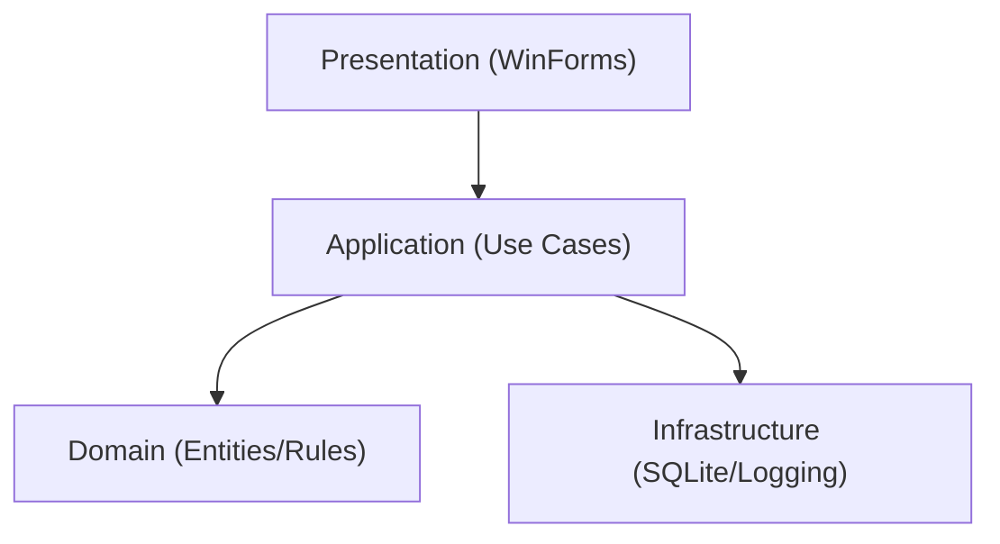

# 1. Executive Summary
- Projeto é um CRUD WinForms .NET Framework 4.7.2, com dados apenas em memória.
- Forte como exercício inicial de lógica/eventos/UI desktop.
- Fraco para mercado internacional: sem persistência, sem testes, sem arquitetura em camadas, sem automação.
- Estado global estático (`Cadastro.listaPessoas`) acopla tudo e limita escalabilidade.
- Há risco de crash por `int.Parse` sem validação.
- Repositório aparenta pouco profissional por incluir `.vs`, `bin`, `obj` e sem README técnico.
- Maturidade percebida hoje: júnior (com alguns pontos de pleno em organização básica de fluxo CRUD).
- Atratividade atual para recrutadores internacionais: baixa.
- Maior alavanca de valor: transformar em app “production-like” (camadas + persistência + testes + observabilidade + CI).
- Com evolução correta, pode virar bom case de “legacy modernization” (WinForms -> arquitetura limpa).

# 2. Recruiter / Hiring Manager Lens
- Comunica: pessoa com base prática de C# e UI desktop, mas ainda sem sinais fortes de engenharia de produto.
- Nível percebido: júnior/pleno inicial.
  - Por quê: lógica no code-behind, estado global, validação frágil, ausência total de testes/CI/doc de arquitetura.
- Impressiona positivamente:
  - CRUD completo funcional.
  - Uso de `BindingList` para atualização visual simples.
- Gera desconfiança/amador:
  - Dados não persistem.
  - Falta de tratamento de erro.
  - Inconsistência de naming (projeto “CadastroPessoas” vs namespace/assembly “ContaBancaria”).
  - Artefatos locais versionados.
- Para virar diferencial:
  - Persistência real (SQLite + migrations), arquitetura em camadas, testes automatizados, README forte e pipeline CI.

# 3. Deep Technical Review

## Arquitetura
- Status atual: lógica central em classe estática + formulários.
- Problema: sem separação de domínio/aplicação/infra.
- Impacto: baixa testabilidade e evolução cara.
- Recomendação: introduzir `Application Services` + `Repository`.
- Prioridade: alta.

## Estrutura de pastas
- Status atual: tudo na raiz.
- Problema: difícil navegação e crescimento.
- Impacto: manutenção ruim.
- Recomendação: `src/Presentation`, `src/Application`, `src/Domain`, `src/Infrastructure`, `tests`.
- Prioridade: alta.

## Separação de responsabilidades
- Status atual: Forms fazem input, regra e feedback.
- Problema: UI acoplada a regra de negócio.
- Impacto: refatorações quebradiças.
- Recomendação: mover regras para services e validar via DTO/Result.
- Prioridade: alta.

## Qualidade de módulos/componentes
- Status atual: CRUD básico repetido em múltiplos forms.
- Problema: duplicação de busca e preenchimento.
- Impacto: inconsistência.
- Recomendação: extrair métodos compartilhados/use cases.
- Prioridade: média.

## Naming
- Status atual: nomes mistos e inconsistentes.
- Problema: `CadastroPessoas.csproj` vs `ContaBancaria` ([CadastroPessoas.csproj](/C:/Users/JCE3AB/Desktop/CRUD-main/CadastroPessoas.csproj):9-10).
- Impacto: baixa credibilidade.
- Recomendação: padronizar domínio e idioma (idealmente inglês para mercado internacional).
- Prioridade: alta.

## Legibilidade
- Status atual: simples, porém com ruído.
- Problema: `using` não utilizados e comentários mortos ([Pessoa.cs](/C:/Users/JCE3AB/Desktop/CRUD-main/Pessoa.cs):15).
- Impacto: aparência de código inicial.
- Recomendação: limpar imports/comentários e aplicar analyzers.
- Prioridade: média.

## Reuso
- Status atual: pouca abstração.
- Problema: repetição de “pesquisar por CPF” em forms.
- Impacto: retrabalho.
- Recomendação: serviço de consulta + presenter/viewmodel.
- Prioridade: média.

## Acoplamento
- Status atual: acoplamento alto via static.
- Problema: estado global mutável ([Cadastro.cs](/C:/Users/JCE3AB/Desktop/CRUD-main/Cadastro.cs):13).
- Impacto: comportamento imprevisível em escala.
- Recomendação: DI + instâncias por ciclo de vida.
- Prioridade: alta.

## Gerenciamento de estado
- Status atual: `BindingList` estática em memória.
- Problema: sem persistência, sem concorrência.
- Impacto: perda total de dados ao fechar app.
- Recomendação: SQLite + Unit of Work simples.
- Prioridade: alta.

## Camada de dados/APIs
- Status atual: inexistente.
- Problema: não há repository/database.
- Impacto: não “parece produto”.
- Recomendação: `IPessoaRepository` + implementação `SqlitePessoaRepository`.
- Prioridade: alta.

## Tratamento de erros
- Status atual: frágil.
- Problema: `int.Parse` pode quebrar app ([FormCadastro.cs](/C:/Users/JCE3AB/Desktop/CRUD-main/FormCadastro.cs):37, [FormEditar.cs](/C:/Users/JCE3AB/Desktop/CRUD-main/FormEditar.cs):38); possível null em edição ([FormEditar.cs](/C:/Users/JCE3AB/Desktop/CRUD-main/FormEditar.cs):41 com `dadosatuais` nulo).
- Impacto: crashes e UX ruim.
- Recomendação: `TryParse`, validação e retorno de erro amigável.
- Prioridade: alta.

## Observabilidade
- Status atual: só `MessageBox`.
- Problema: sem logs/telemetria.
- Impacto: difícil diagnosticar falhas.
- Recomendação: logging estruturado (Serilog/NLog) + arquivo local.
- Prioridade: média.

## Autenticação/autorização
- Status atual: não aplicável ao escopo atual.
- Problema: para produção, faltaria segurança de acesso.
- Impacto: limita casos reais.
- Recomendação: se evoluir para SaaS/API, incluir auth e RBAC.
- Prioridade: baixa (agora).

## Segurança
- Status atual: validação mínima.
- Problema: CPF sem validação/formato; entradas livres.
- Impacto: baixa integridade de dados.
- Recomendação: validações de domínio e mascaramento.
- Prioridade: média.

## Performance
- Status atual: busca linear.
- Problema: O(n) por CPF ([Cadastro.cs](/C:/Users/JCE3AB/Desktop/CRUD-main/Cadastro.cs):25).
- Impacto: degrada com volume maior.
- Recomendação: índice por CPF (dictionary) ou índice DB único.
- Prioridade: média.

## Acessibilidade
- Status atual: não avaliada profundamente, mas padrão WinForms básico.
- Problema: possivelmente sem atalhos/tab order/labels semânticos.
- Impacto: UX mais fraca.
- Recomendação: revisar navegação por teclado e mensagens de erro.
- Prioridade: média.

## SEO
- Status atual: não aplicável (desktop).

## Testes
- Status atual: nenhum.
- Problema: sem garantia de regressão.
- Impacto: baixa confiança técnica.
- Recomendação: xUnit/NUnit com testes de service/regras.
- Prioridade: alta.

## CI/CD
- Status atual: nenhum pipeline.
- Problema: sem build/test automatizado.
- Impacto: baixa maturidade.
- Recomendação: GitHub Actions (restore/build/test/analyzers).
- Prioridade: alta.

## Configuração de ambiente
- Status atual: old-style csproj .NET Framework 4.7.2.
- Problema: onboarding e build cross-machine mais difíceis.
- Impacto: fricção para avaliador.
- Recomendação: migrar para SDK-style e preferencialmente .NET 8 (WinForms).
- Prioridade: média/alta.

## Documentação
- Status atual: sem README técnico.
- Problema: sem narrativa de produto/arquitetura.
- Impacto: recrutador abandona rápido.
- Recomendação: README completo com decisões, trade-offs e roadmap.
- Prioridade: alta.

## Deploy/produção
- Status atual: sem estratégia.
- Problema: sem release/versionamento/instalador.
- Impacto: não demonstra ciclo real.
- Recomendação: release pipeline + instalador (MSIX/ClickOnce) + changelog.
- Prioridade: média.

# 4. Portfolio Competitiveness Analysis
- Genérico hoje:
  - CRUD local simples, sem diferencial funcional/técnico.
- Tornaria memorável:
  - Transformar em “Customer Registry Platform” com persistência, auditoria, filtros avançados e import/export.
- Sinais de maturidade de engenharia:
  - arquitetura em camadas, testes, CI, logs, tratamento de erro robusto, documentação de decisões.
- Sinais de “produção”:
  - backup/restore, versionamento de schema, política de validação, monitoramento local, releases reproduzíveis.

# 5. High-Impact Improvements

## Quick wins
- Adicionar `.gitignore` para `.vs/bin/obj`
  - recrutadores: 5 | técnico: 2 | esforço: 1 | prioridade: alta
  - motivo: impacto imediato de profissionalismo.
- Criar README de alto nível com setup e arquitetura atual
  - 5 | 2 | 1 | alta
  - motivo: melhora avaliação inicial.
- Corrigir naming inconsistente do projeto
  - 4 | 2 | 2 | alta
  - motivo: remove sinal amador.
- Validar inputs (`TryParse`, CPF obrigatório)
  - 4 | 4 | 1 | alta
  - motivo: elimina crashes.

## Melhorias de arquitetura
- Introduzir `PessoaService` + `IPessoaRepository`
  - 5 | 5 | 3 | alta
- Remover estado static global
  - 5 | 5 | 3 | alta
- Migrar para arquitetura feature/domain-driven leve
  - 4 | 5 | 4 | média-alta

## Melhorias de UX/UI
- Estados de erro/sucesso padronizados e não bloqueantes
  - 4 | 3 | 2 | média
- Máscara/validação visual de CPF e idade
  - 4 | 3 | 2 | média
- Tela de listagem com busca, ordenação e paginação
  - 3 | 3 | 3 | média

## Melhorias de código
- Remover duplicação de lógica de pesquisa/preenchimento
  - 3 | 4 | 2 | média
- Adotar analyzers + regras de estilo
  - 4 | 3 | 2 | média-alta
- Refatorar para async onde fizer sentido (I/O)
  - 3 | 3 | 2 | baixa-média

## Melhorias de produto
- Persistência SQLite com constraints únicas de CPF
  - 5 | 5 | 3 | alta
- Histórico/auditoria de mudanças
  - 5 | 4 | 3 | alta
- Importação/Exportação CSV
  - 4 | 3 | 2 | média-alta

## Melhorias de credibilidade profissional
- GitHub Actions build/test
  - 5 | 4 | 2 | alta
- Testes unitários + integração de repositório
  - 5 | 5 | 3 | alta
- ADRs (Architecture Decision Records)
  - 4 | 3 | 2 | média-alta

## Melhorias para produção
- Installer + releases versionadas
  - 4 | 3 | 3 | média
- Logging estruturado + rotação
  - 4 | 4 | 2 | média-alta
- Política de tratamento de exceções global
  - 4 | 4 | 2 | média-alta

# 6. Suggested Architecture Evolution
- Visão atual: forms -> classe estática `Cadastro` -> lista em memória.
- Problemas principais: acoplamento alto, sem persistência, sem testes.
- Arquitetura alvo:
  - `Presentation (WinForms)` chama `Application Services`
  - `Application` usa `Domain` e interfaces de `Repository`
  - `Infrastructure` implementa SQLite/logging
- Responsabilidades:
  - Domain: `Pessoa`, regras (CPF válido, idade mínima, unicidade lógica).
  - Application: casos de uso (`CreatePessoa`, `UpdatePessoa`, etc.).
  - Infrastructure: banco, migrações, repositórios.
  - Presentation: eventos e binding.
- Pastas sugeridas:
  - `src/CustomerRegistry.Presentation.WinForms`
  - `src/CustomerRegistry.Application`
  - `src/CustomerRegistry.Domain`
  - `src/CustomerRegistry.Infrastructure`
  - `tests/CustomerRegistry.Application.Tests`
- Padrões recomendados:
  - Repository + Service Layer + Result Pattern.
- Trade-offs:
  - mais arquivos/complexidade inicial, mas melhora manutenção e testes.
- Migração sem quebrar:
  1. Criar service/repository mantendo forms atuais.
  2. Migrar chamadas dos forms para service.
  3. Trocar storage in-memory por SQLite.
  4. Adicionar testes e depois remover legado estático.

# 7. Suggested Commit Plan
1. `chore: add gitignore and remove local IDE/build artifacts`
- Objetivo: higienizar repositório.
- Áreas: `.gitignore`, remoção `.vs/`, `bin/`, `obj/`.
- Por quê: impressão profissional imediata.

2. `docs: add professional README with architecture, setup and roadmap`
- Objetivo: narrativa de produto e engenharia.
- Áreas: `README.md`, `docs/architecture.md`.
- Por quê: recrutador entende valor rapidamente.

3. `refactor: standardize solution naming and project identity`
- Objetivo: consistência de naming.
- Áreas: `.sln`, `.csproj`, namespace.
- Por quê: remove ambiguidade “CadastroPessoas/ContaBancaria”.

4. `feat: add input validation and safe parsing for person forms`
- Objetivo: evitar crashes.
- Áreas: `FormCadastro.cs`, `FormEditar.cs`, `FormPesquisar.cs`.
- Por quê: robustez de UX.

5. `refactor: extract person management into application service`
- Objetivo: separar UI de regra.
- Áreas: novo `Application/PessoaService.cs`, ajustar forms.
- Por quê: testabilidade.

6. `feat: introduce repository abstraction and in-memory implementation`
- Objetivo: preparar persistência.
- Áreas: `Domain`, `Application`, `Infrastructure`.
- Por quê: desacoplamento.

7. `feat: add sqlite repository with cpf uniqueness constraint`
- Objetivo: persistência real.
- Áreas: `Infrastructure/Sqlite`, config.
- Por quê: sinal de produção.

8. `test: add unit tests for pessoa service validation and CRUD flows`
- Objetivo: qualidade automatizada.
- Áreas: `tests/*`.
- Por quê: credibilidade técnica.

9. `ci: add github actions workflow for build and tests`
- Objetivo: CI.
- Áreas: `.github/workflows/ci.yml`.
- Por quê: maturidade de engenharia.

10. `feat: add structured logging and global exception handling`
- Objetivo: diagnósticos e resiliência.
- Áreas: startup, infra logging.
- Por quê: operação de produção.

# 8. README / GitHub / Portfolio Presentation
- Título: `Customer Registry Desktop App (WinForms, Clean Architecture, SQLite)`
- Descrição curta: `Production-oriented desktop CRUD with layered architecture, validation, tests, CI and local observability.`
- README ideal (seções obrigatórias):
  - Problem Statement
  - Demo (GIF + screenshots)
  - Architecture Overview (diagrama)
  - Tech Stack
  - Key Engineering Decisions
  - Validation/Security Rules
  - Testing Strategy
  - CI/CD
  - Local Setup
  - Trade-offs
  - Roadmap
  - Why this project matters
- Incluir:
  - badges (`build`, `tests`, `license`, `dotnet`)
  - diagrama Mermaid
  - link para release/demo
  - seção “Results/Impact” (ex.: crash rate antes/depois validação)
  - ADRs em `docs/adr`.
- Talking point forte:
  - “Peguei um CRUD WinForms simples e evoluí para arquitetura de produção com qualidade mensurável.”

# 9. Interview Readiness
1. Como você separou UI de regra de negócio?
- Esperado: service layer + repository + forms apenas orquestrando input/output.
2. Por que remover estado global estático?
- Esperado: previsibilidade, testes, isolamento.
3. Como garantiu unicidade de CPF?
- Esperado: regra de domínio + constraint no banco.
4. Como tratou erros de input?
- Esperado: validação explícita + mensagens úteis + sem exceções de parse.
5. Estratégia de testes?
- Esperado: unitários em services e integração no repository SQLite.
6. Como evoluir para multiusuário?
- Esperado: API backend + autenticação + lock/concurrency strategy.
7. Trade-off WinForms vs Web?
- Esperado: contexto de uso local/offline vs alcance web.
8. Como você observa falhas?
- Esperado: logs estruturados e tratamento global de exceções.
9. Como manter backward compatibility ao refatorar?
- Esperado: migração incremental por camadas.
10. Como organizar commits?
- Esperado: pequenos, semânticos, com objetivo único.
11. Por que usar SQLite?
- Esperado: simplicidade local, portabilidade e baixa fricção.
12. Como configurou CI?
- Esperado: restore/build/test com falha bloqueando merge.
13. Como lidou com dados inválidos já existentes?
- Esperado: script de saneamento/migração.
14. Quais métricas de qualidade você acompanhou?
- Esperado: cobertura, falhas de build, defeitos encontrados.
15. Próximo passo para produção real?
- Esperado: auth, auditoria, backup, telemetry e distribuição.
- Pontos para defender bem no projeto atual: decisões de validação, separação de camadas, persistência.
- Decisões que precisa justificar melhor: escolha de framework antigo, ausência de API, estratégia de escalabilidade.

# 10. Final Action Plan

## Fase 1: maior ROI
- Objetivo: sair de “tutorial” para “profissional”.
- Itens: `.gitignore`, README forte, validação robusta, naming consistente.
- Resultado: melhor primeira impressão e menos falhas.
- Imagem para recrutador: cuidado com qualidade e comunicação.

## Fase 2: diferenciação
- Objetivo: sinal claro de maturidade de engenharia.
- Itens: service layer, repository, SQLite, testes unitários/integrados, CI.
- Resultado: projeto demonstrável em entrevistas técnicas.
- Imagem para recrutador: pleno/sênior inicial com visão de arquitetura.

## Fase 3: nível produção
- Objetivo: mostrar preparo real para ambientes corporativos.
- Itens: logging estruturado, exceção global, auditoria, release pipeline, docs de decisões.
- Resultado: case sólido de produto.
- Imagem para recrutador: engenheiro com pensamento de operação e escala.

Notas (0-10):
- Apelo para recrutadores: **3.5/10**
- Maturidade técnica: **3/10**
- Clareza arquitetural: **2.5/10**
- Qualidade de produto: **3/10**
- Prontidão para portfólio internacional: **3/10**

# Plano Estratégico de Evolução do Projeto (Portfolio Internacional)

## 1) Top 10 melhorias com maior ROI

| # | Melhoria | Impacto recrutador (1-5) | Impacto técnico (1-5) | Esforço (1-5) | ROI |
|---|---|---:|---:|---:|---|
| 1 | Adicionar `.gitignore` e remover `.vs`, `bin`, `obj` do repo | 5 | 2 | 1 | Muito alto |
| 2 | Criar README profissional com narrativa técnica e de produto | 5 | 2 | 1 | Muito alto |
| 3 | Corrigir validações de input (`TryParse`, CPF obrigatório, mensagens de erro) | 4 | 4 | 1 | Muito alto |
| 4 | Padronizar naming (projeto/namespace/domínio, preferencialmente em inglês) | 4 | 2 | 2 | Alto |
| 5 | Extrair lógica de negócio dos Forms para `PessoaService` | 5 | 5 | 3 | Alto |
| 6 | Introduzir `IPessoaRepository` para desacoplar dados | 5 | 5 | 3 | Alto |
| 7 | Persistência real com SQLite + constraint única de CPF | 5 | 5 | 3 | Alto |
| 8 | Adicionar testes unitários dos casos de uso principais | 5 | 5 | 3 | Alto |
| 9 | Configurar CI com GitHub Actions (build + test) | 5 | 4 | 2 | Alto |
| 10 | Logging estruturado + tratamento global de exceções | 4 | 4 | 2 | Médio/alto |

---

## 2) Top 10 commits que você deveria fazer primeiro

1. `chore: add gitignore and remove IDE/build artifacts`  
2. `docs: add portfolio-grade README with architecture and setup`  
3. `refactor: standardize solution and namespace naming in english`  
4. `feat: add robust input validation and safe parsing in forms`  
5. `refactor: extract person use cases into application service`  
6. `feat: introduce repository abstraction with in-memory implementation`  
7. `feat: add sqlite persistence and unique cpf constraint`  
8. `test: add unit tests for person service and validation rules`  
9. `ci: add github actions workflow for restore build and test`  
10. `feat: add structured logging and global exception handling`  

---

## 3) Arquitetura alvo simples e elegante

## Visão alvo
```text
Presentation (WinForms)
  -> Application (Use Cases / Services)
    -> Domain (Entities + Business Rules)
      -> Infrastructure (SQLite, Logging, Config)
```

## Responsabilidades por camada
- `Presentation`: captura input, renderiza estado, chama serviços.
- `Application`: orquestra casos de uso (`CreatePerson`, `UpdatePerson`, etc.).
- `Domain`: entidade `Person` + regras (idade válida, CPF válido/único).
- `Infrastructure`: repositório SQLite, logging, leitura de config.

## Estrutura de pastas sugerida
```text
src/
  CustomerRegistry.Presentation.WinForms/
  CustomerRegistry.Application/
  CustomerRegistry.Domain/
  CustomerRegistry.Infrastructure/
tests/
  CustomerRegistry.Application.Tests/
  CustomerRegistry.Infrastructure.Tests/
docs/
  architecture.md
  adr/
```

## Regras de design
- Sem estado global estático mutável.
- Sem regra de negócio no code-behind dos Forms.
- Dados sempre acessados via interface (`IPessoaRepository`).
- Erros retornam resultado de domínio/aplicação, não exceções cruas para UI.

---

## 4) Plano de evolução em 30 dias

## Semana 1 (Fundação e impressão profissional)
- Criar `.gitignore`.
- Limpar artefatos versionados.
- Padronizar naming.
- Criar README inicial forte.
- Corrigir validações e parsing.
- Resultado esperado: projeto deixa de parecer tutorial.

## Semana 2 (Arquitetura e desacoplamento)
- Criar `PessoaService`.
- Criar contratos (`IPessoaRepository`).
- Mover lógica dos Forms para Application.
- Implementação in-memory temporária.
- Resultado esperado: base testável e mais legível.

## Semana 3 (Persistência e qualidade)
- Implementar repositório SQLite.
- Garantir unicidade de CPF no banco.
- Adicionar testes unitários e alguns de integração.
- Resultado esperado: projeto com sinal de produção real.

## Semana 4 (Credibilidade internacional)
- Configurar CI no GitHub Actions.
- Adicionar logging estruturado.
- Adicionar tratamento global de exceções.
- Criar diagrama de arquitetura e ADRs.
- Publicar release com changelog.
- Resultado esperado: peça de portfólio competitiva para vagas globais.

---

## 5) O que colocar no README para convencer recrutadores

## Estrutura obrigatória (ordem recomendada)
1. **Title + One-liner de valor**
2. **Problem Statement**
3. **Demo (GIF/screenshot)**
4. **Architecture Overview (diagrama)**
5. **Tech Stack (com justificativa curta)**
6. **Key Engineering Decisions**
7. **Validation & Error Handling**
8. **Testing Strategy**
9. **CI/CD**
10. **How to Run**
11. **Roadmap**
12. **Trade-offs**
13. **Why this project matters**

## Template pronto (copiar e adaptar)

```markdown
# Customer Registry Desktop App

Production-oriented WinForms CRUD application designed to demonstrate layered architecture, data persistence, validation, testing, and CI quality gates.

## Problem Statement
Most CRUD portfolio projects stop at UI interactions and in-memory state.
This project evolves that baseline into a maintainable, testable, and production-oriented desktop system.

## Demo
- Main flow: Create, Search, Update, Delete person records
- Persistence: SQLite local database
- Screenshots/GIF: (add links)

## Architecture


## Tech Stack
- C# / .NET
- WinForms
- SQLite
- xUnit/NUnit
- GitHub Actions

## Key Engineering Decisions
- Extracted business rules from Forms into Application services.
- Introduced repository abstraction for testability and storage swap.
- Added input validation and safe parsing to prevent runtime crashes.

## Validation & Error Handling
- Age parsing uses safe conversion (`TryParse`).
- Required fields validated before use case execution.
- Domain/Application returns explicit failure reasons to UI.
- Global exception handler + structured logs.

## Testing Strategy
- Unit tests for use cases and business rules.
- Integration tests for SQLite repository behavior.
- CI blocks merge on failing tests.

## CI/CD
- GitHub Actions pipeline:
  - restore
  - build
  - test
  - (optional) static analysis

## How to Run
1. Clone repository
2. Restore dependencies
3. Build solution
4. Run desktop app
5. (Optional) run tests

## Trade-offs
- WinForms chosen for fast desktop iteration.
- Scope prioritizes architecture quality over advanced UI polish.
- SQLite chosen for local simplicity and reproducibility.

## Roadmap
- Import/Export CSV
- Audit trail
- Filtering and sorting improvements
- Packaging and installer

## Why this project matters
This project shows not only coding ability but engineering maturity:
architecture boundaries, reliability, testability, and production mindset.
```

---

## Extra: versão curta para seu perfil/portfolio
- “Refactored a basic WinForms CRUD into a production-oriented layered architecture with SQLite persistence, automated tests, CI pipeline, and structured logging.”  
- “Focused on maintainability, reliability, and interview-ready engineering trade-offs.”